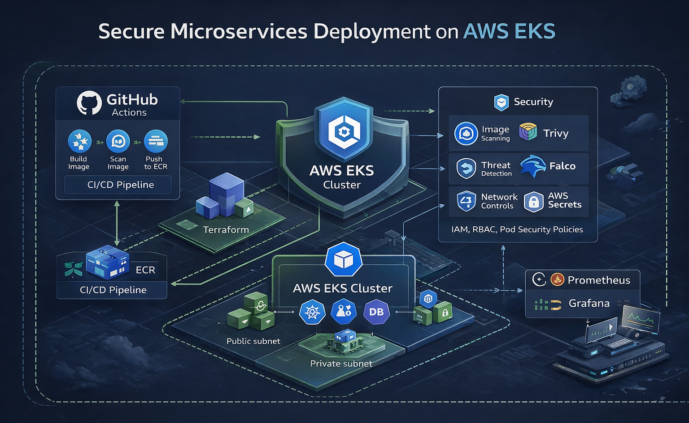

# IN CONSTRUCTION YET.

# 🛡️ Secure Microservice Deployment on AWS EKS

This project implements a **Production-Ready DevSecOps Environment** on AWS. It follows the "Secure-by-Design" principle, ensuring that every layer—from the network to the running container—is protected, monitored, and automated.

# 📐 Architecture Design

The following diagram illustrates the infrastructure and security layers implemented using Terraform. It highlights the network isolation, identity management (IRSA), and the runtime security monitoring.



> **Note:** The architecture follows the **AWS Well-Architected Framework**, specifically focusing on the Security and Reliability pillars.

---

# 🏗️ Technical Architecture Layers

## 1. Network Layer (The Foundation)
* **Multi-AZ Deployment:** Infrastructure is spread across two **Availability Zones (AZs)** to ensure High Availability (HA).
* **Subnet Segmentation:** * **Public Subnets:** Host the NAT Gateway and the Application Load Balancer (ALB). These are the only components with direct internet exposure.
    * **Private Subnets:** This is where the **EKS Worker Nodes** reside. They have no public IP addresses, significantly reducing the attack surface.
* **Secure Egress:** Nodes access the internet (to pull updates or patches) strictly through the **NAT Gateway**.

## 2. Compute & Orchestration (The Brain)
* **Amazon EKS (Elastic Kubernetes Service):** A managed Kubernetes control plane that eliminates the operational burden of managing master nodes.
* **Managed Node Groups:** Two `t3.medium` instances provide the compute power. They are automatically patched and updated by AWS.
* **EBS CSI Driver:** Enables dynamic provisioning of **Amazon EBS** volumes, allowing stateful applications (like databases) to persist data securely.

## 3. Security & Identity (The Shield)
* **IAM Roles for Service Accounts (IRSA):** Utilizing **OIDC** to map specific AWS IAM Roles to Kubernetes Service Accounts, following the **Principle of Least Privilege**.
* **Runtime Security (Falco):** A security monitor deployed as a DaemonSet using **eBPF** probes to inspect kernel system calls, detecting unauthorized activities like shell executions in real-time.
* **Container Security:** Images are scanned for vulnerabilities using **Trivy** before being pushed to the private registry.

---

## 4. 🛠️ The DevSecOps Workflow

1.  **Code:** Developer pushes code to GitHub.
2.  **Scan:** GitHub Actions triggers **Trivy** to scan the container image for CVEs.
3.  **Store:** Secure images are pushed to **Amazon ECR** (Elastic Container Registry).
4.  **Deploy:** Terraform-managed EKS pulls the image and deploys it into the private subnets.
5.  **Monitor:** **Falco** monitors the running containers for any suspicious behavior.

---

## 5. 📂 Project Structure (IaC)

* `vpc.tf`: Network foundation including ( VPC, Public/Private Subnets, Internet Gateway, and NAT Gateway for secure egress).
* `eks.tf`: Amazon EKS Cluster configuration and Managed Node Groups (EC2 Workers) definition.
* `eks-addons.tf`: Management of critical Kubernetes extensions, specifically the Amazon **EBS CSI Driver** for storage persistence.
* `security.tf`: Implementation of Runtime Security using **Falco** deployed via (**Helm provider**) to monitor kernel system calls.
* `security-groups.tf`: Fine-grained firewall rules (Security Groups) for the EKS Cluster and Node communication.
* `providers.tf`: Manages the connection to **AWS** and orchestrates the configuration for **Kubernetes** and **Helm providers**, including required versions for infrastructure consistency.
* `variables.tf`: Input variables to make the infrastructure reusable and configurable **(Region, Cluster Name, CIDRs)**.
* `outputs.tf`: Essential infrastructure data exported after deployment **(Cluster Endpoint, Security Group IDs, Kubeconfig details)**.
* `ecr.tf`: Private Container Registry ( **ECR** )
* `kube-config.tf`: Configure kube-config for conection to AWS EKS Cluster
* `helm_addons.tf`: installing falco security using terraform file


---

## 6. 🏗️ Technical Architecture Layers (Additions)

### Container Registry & Lifecycle (The Vault):

* `Amazon ECR`: A private registry configured with IMMUTABLE tags to prevent image tampering and KMS Encryption for data at rest.

* `Lifecycle Policies`: Automated rules to retain only the 5 most recent images, ensuring cost-optimization and staying within the AWS Free Tier limits.

* `Scan-on-Push`: Integrated vulnerability scanning that triggers every time a new image is uploaded.

---

## 7. 🛠️ The DevSecOps Pipeline (GitHub Actions)

The project implements an automated **"Security Guardian"** workflow located at `.github/workflows/deploy.yml`. This pipeline ensures that only scanned and verified code reaches the production environment.

### 🛡️ Workflow Stages

*  **Checkout Code:** Clones the repository into the GitHub runner environment.
*  **Build Image:** Builds a Docker image based on the project's `Dockerfile`.
*  **Vulnerability Scan (Trivy):** 🚨 **Critical Security Gate.** Scans the container image for **CVEs** (Common Vulnerabilities and Exposures). If **CRITICAL** vulnerabilities are detected, the pipeline fails immediately, blocking the deployment.
*   **AWS Authentication:** Uses **GitHub Repository Secrets** (`AWS_ACCESS_KEY_ID` & `AWS_SECRET_ACCESS_KEY`) to securely authenticate with AWS.
*  **ECR Push:** Once verified as secure, the image is tagged and pushed to the private **Amazon ECR** repository managed by Terraform.

---

## 8. 🚀 How to Deploy

### Infrastructure Provisioning
Initialize and apply the Terraform configuration to create the VPC, EKS cluster, and ECR repository:

```bash
cd terraform
terraform init
terraform apply -auto-approve
```
---

## 9. 🚀 CI/CD Pipeline & Security Architecture

This project implements a robust **DevSecOps pipeline** using GitHub Actions to automate the software development lifecycle with a "Security-First" approach.

### 🛡️ Pipeline Stages
The automation workflow consists of the following phases:
1. **Source Code Checkout**: Pulls the latest code from the repository.
2. **AWS Authentication**: Securely connects to AWS using IAM roles/secrets.
3. **Docker Build**: Builds the container image using the **Git Commit SHA** as a tag to ensure **Immutability**.
4. **Security Scanning (Trivy)**: Scans the container image for High and Critical vulnerabilities. **The pipeline will fail** if security risks are detected, preventing insecure images from reaching production.
5. **ECR Push**: Once verified, the image is pushed to the private Amazon ECR repository.

### 🔐 GitHub Actions Secrets Configuration
To enable the pipeline, the following **Repository Secrets** must be configured in GitHub (Settings > Secrets and variables > Actions):

| Secret Name | Description |
| :--- | :--- |
| `AWS_ACCESS_KEY_ID` | IAM User Access Key with ECR/EKS permissions. |
| `AWS_SECRET_ACCESS_KEY` | IAM User Secret Access Key. |
| `AWS_REGION` | AWS Region (e.g., `us-east-1`). |
| `ECR_REPOSITORY` | The name of the ECR repository created by Terraform (`eks-armor-flow`). |

## 🦉 Runtime Security: Falco Deployment

This project supports two methods for deploying **Falco** to the EKS cluster. However, to maintain **Infrastructure as Code (IaC)** integrity, **Terraform is the preferred and default method** for this deployment.

### 🏗️ Method 1: Terraform (Recommended)
The Falco deployment is fully automated via the `helm_addons.tf` configuration. This ensures that security is provisioned simultaneously with the cluster.

- **Driver:** eBPF (Modern, non-intrusive)
- **Features:** Includes `falcosidekick` and `webui` for alert visualization.
- **Usage:**
  ```bash
  terraform init
  terraform apply

### 📜 Method 2: Bash Script (Legacy/Testing)
A utility script is provided in scripts/install_falco.sh for quick testing or standalone installations. While functional, it is not used for the main production-ready workflow of this project.

Usage:
```Bash

chmod +x scripts/install_falco.sh
./scripts/install_falco.sh
```
> **GNU Note**: We chose Terraform for this project to ensure a repeatable, version-controlled security posture that automatically scales with the infrastructure.
---

## 📦 Container Lifecycle & Registry Management

To ensure a secure and consistent deployment, we follow a strict workflow for building and pushing images to **Amazon ECR**.

### 🔐 1. Authentication & Security
Before interacting with the private registry, we authenticate the local Docker daemon using the AWS CLI. This ensures that only authorized entities can push images to our "Vault".

```bash
aws ecr get-login-password --region us-east-1 | \
docker login --username AWS --password-stdin <AWS_ACCOUNT_ID>.dkr.ecr.us-east-1.amazonaws.com
```
### 🏗️ 2. Build & Strategy

The application is built using a multi-stage-ready Dockerfile (using python:3.12-slim for a reduced attack surface). We use specific tagging to maintain version control:

* `Local Build`: docker build -t eks-armor-flow.
* `Remote Tagging`: Tagging the image with the full ECR URI to point to our private repository.

* `Push`: Offloading the image layers to AWS.

### 📑 3. Image Architecture (Manifests)

Upon successful push, Amazon ECR generates an Image Index. This allows the EKS cluster to pull the correct architecture (e.g., amd64) based on the Node Group configuration.

* `Immutability`: Images are stored with specific digests (SHA256) to ensure that the code running in production is exactly what was scanned by Trivy during the CI/CD phase.
---

### 🛡️ 4.Security & Secret Management (The Golden Rule)

In this project, we strictly adhere to the DevSecOps principle: **"Never hardcode secrets or Account IDs in the source code."** To protect the infrastructure and maintain a portable codebase, we implement **Dynamic Injection** via GitHub Secrets.

### 🔐 Secret Masking
Sensitive identifiers such as `AWS_ACCOUNT_ID`, `AWS_ACCESS_KEY`, and `ECR_REPOSITORY` are stored in **GitHub Actions Secrets**. This ensures:
- **Zero Exposure:** Account IDs are masked in CI/CD logs with `***`.
- **Governance:** Only authorized users with repository access can view or modify these variables.

### 🚀 Dynamic Deployment with `sed`
Instead of hardcoding the image URI in our Kubernetes manifests (`k8s/deploymets-secure-app.yaml`), we use a placeholder:

```yaml
# k8s/deployment.yaml
image: IMAGE_PLACEHOLDER
During the Continuous Deployment (CD) phase, the pipeline dynamically replaces this placeholder using the current commit SHA:

Bash
sed -i "s|IMAGE_PLACEHOLDER|$FULL_IMAGE_URI|g" k8s/deployment.yaml
```
--- 
### 🌐 4. Networking & Exposure
The application is exposed via a **Kubernetes Service** of type `LoadBalancer`. 

- **Internal Port:** 80
- **External Port:** 80
- **Cloud Integration:** Automatically provisions an **AWS Classic Load Balancer (CLB)**.

To retrieve the public DNS endpoint, run:
```bash
kubectl get svc secure-app-service -o jsonpath='{.status.loadBalancer.ingress[0].hostname}'
```
