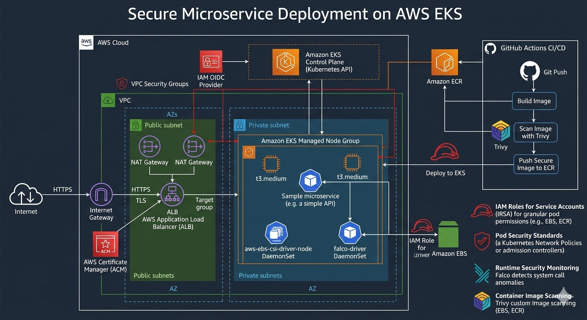

# 🛡️ Secure Microservice Deployment on AWS EKS

This project implements a **Production-Ready DevSecOps Environment** on AWS. It follows the "Secure-by-Design" principle, ensuring that every layer—from the network to the running container—is protected, monitored, and automated.

## 📐 Architecture Design

The following diagram illustrates the infrastructure and security layers implemented using Terraform. It highlights the network isolation, identity management (IRSA), and the runtime security monitoring.



> **Note:** The architecture follows the **AWS Well-Architected Framework**, specifically focusing on the Security and Reliability pillars.

---

## 🏗️ Technical Architecture Layers

### 1. Network Layer (The Foundation)
* **Multi-AZ Deployment:** Infrastructure is spread across two **Availability Zones (AZs)** to ensure High Availability (HA).
* **Subnet Segmentation:** * **Public Subnets:** Host the NAT Gateway and the Application Load Balancer (ALB). These are the only components with direct internet exposure.
    * **Private Subnets:** This is where the **EKS Worker Nodes** reside. They have no public IP addresses, significantly reducing the attack surface.
* **Secure Egress:** Nodes access the internet (to pull updates or patches) strictly through the **NAT Gateway**.

### 2. Compute & Orchestration (The Brain)
* **Amazon EKS (Elastic Kubernetes Service):** A managed Kubernetes control plane that eliminates the operational burden of managing master nodes.
* **Managed Node Groups:** Two `t3.medium` instances provide the compute power. They are automatically patched and updated by AWS.
* **EBS CSI Driver:** Enables dynamic provisioning of **Amazon EBS** volumes, allowing stateful applications (like databases) to persist data securely.

### 3. Security & Identity (The Shield)
* **IAM Roles for Service Accounts (IRSA):** Utilizing **OIDC** to map specific AWS IAM Roles to Kubernetes Service Accounts, following the **Principle of Least Privilege**.
* **Runtime Security (Falco):** A security monitor deployed as a DaemonSet using **eBPF** probes to inspect kernel system calls, detecting unauthorized activities like shell executions in real-time.
* **Container Security:** Images are scanned for vulnerabilities using **Trivy** before being pushed to the private registry.

---

## 🛠️ The DevSecOps Workflow

1.  **Code:** Developer pushes code to GitHub.
2.  **Scan:** GitHub Actions triggers **Trivy** to scan the container image for CVEs.
3.  **Store:** Secure images are pushed to **Amazon ECR** (Elastic Container Registry).
4.  **Deploy:** Terraform-managed EKS pulls the image and deploys it into the private subnets.
5.  **Monitor:** **Falco** monitors the running containers for any suspicious behavior.

---

## 📂 Project Structure (IaC)

* `vpc.tf`: Network definition (VPC, Subnets, NAT Gateway).
* `eks.tf`: Cluster and Managed Node Groups configuration.
* `eks-addons.tf`: Management of critical extensions (**EBS CSI Driver**).
* `security.tf`: Runtime security implementation via **Falco** (Helm provider).

---

## 🚀 Deployment & Verification

### 1. Provisioning
```bash
cd terraform
terraform init
terraform apply -auto-approve
